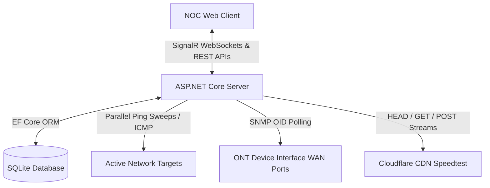

# NetPulse.io | Real-Time NOC Operations & Bandwidth Diagnostics Dashboard

NetPulse is a lightweight, high-performance **NOC (Network Operations Center) monitoring dashboard** designed for telecom engineers and network administrators. Built on **.NET 8** and **SignalR**, it performs parallel SNMP/ICMP diagnostics across multiple target routers, maps OID configurations dynamically based on ONT brand profiles, runs automated traceroutes on performance degradation, and features a self-hosted CDN-based internet speed test with a modern, circular progress ring.

---

## 📸 Overview & Architecture

NetPulse operates as a self-contained web application. The backend runs background tasks that scan active network targets in parallel, while SignalR pushes live telemetry directly to the web client.



---

## ⚡ Core Features

*   🚀 **Parallel ICMP & SNMP Scanning Engine**: Monitors latency, jitter, packet loss, WAN link state, interface speed, and GPON Rx Optical Power (`dBm`) in parallel threads using `Task.WhenAll`.
*   🔄 **ONT Profiles Mapper (Dynamic OID Configuration)**: Allows technicians to register and map custom SNMP OIDs per ONT brand (e.g., Huawei, ZTE, Generic MIB-II) dynamically from the UI.
*   📈 **Real-Time Data Visualization**: Plots latency and jitter charts on-the-fly using **Chart.js** over a sliding window of historical metrics.
*   🛡️ **Auto-Traceroute & NOC Alerting**: Triggers an automatic traceroute tool on performance degradation (e.g., packet loss or latency spikes) to localize the network hop causing congestion, printing live alerts with auto-resolve handlers.
*   🎯 **Multi-Target Selector**: Dynamically switch dashboard monitoring targets via a dropdown menu. The UI instantly swaps chart history and diagnostic logs for the active target.
*   ⏱️ **Self-Hosted Speed Test (Needle-less Progress Dial)**: Benchmark download/upload bandwidth capability using a zero-configuration Cloudflare CDN setup. Features a modern, needle-less circular progress ring inspired by Fast.com with dynamic stage indicators and color-coding:
    *   🔴 **Red** (< 10 Mbps): Low-bandwidth link.
    *   🟡 **Yellow** (10–50 Mbps): Medium-bandwidth link.
    *   🟢 **Green** (>= 50 Mbps): High-bandwidth link.
*   🎨 **Sleek Light/Dark Mode**: Transition entire layouts, charts, forms, and custom badges instantly with a premium glassmorphic visual system.

---

## 🛠️ Technology Stack

| Component | Technologies & Libraries |
| :--- | :--- |
| **Backend Core** | C# 12, .NET 8 SDK, ASP.NET Core Minimal APIs |
| **Real-Time Web** | ASP.NET Core SignalR (WebSockets fallback) |
| **Database & ORM**| SQLite, Entity Framework Core (EF Core) |
| **Network Protocols**| SharpSnmpLib (SNMP library), System.Net.NetworkInformation |
| **Frontend Web** | Semantic HTML5, Vanilla CSS3 (HSL Variables, Flexbox, Grid), Vanilla JavaScript (ES6+) |
| **Data Viz** | Chart.js |

---

## ⚙️ Project Structure Highlights

*   [Services/NetworkMonitoringService.cs](file:///d:/wokwos/Services/NetworkMonitoringService.cs): Parallel monitoring daemon loop. Automatically recreates database tables if schema modifications are detected on startup.
*   [Services/SpeedTestService.cs](file:///d:/wokwos/Services/SpeedTestService.cs): Custom HTTP stream handler (`ProgressReportingStream`) that intercepts socket bytes read/write buffers to track download/upload speeds, throttled to 150ms broadcasts to prevent web client congestion.
*   [Services/GatewayDetector.cs](file:///d:/wokwos/Services/GatewayDetector.cs): Auto-detects local default gateway IP addresses natively across platforms.
*   [Program.cs](file:///d:/wokwos/Program.cs): Registers services and configures routes for targets, ONT profiles, and speed test APIs.

---

## 🚀 Getting Started

### Prerequisites

*   [.NET 8.0 SDK](https://dotnet.microsoft.com/en-us/download/dotnet/8.0)
*   Visual Studio 2022 or VS Code

### Installation & Execution

1.  **Clone the repository**:
    ```bash
    git clone https://github.com/your-username/netpulse-dashboard.git
    cd netpulse-dashboard
    ```
2.  **Restore dependencies and build**:
    ```bash
    dotnet restore
    dotnet build
    ```
3.  **Run the application**:
    ```bash
    dotnet run
    ```
4.  **Open the dashboard**:
    Access [http://localhost:5192](http://localhost:5192) in your browser.

---

## 🛡️ License

This project is open-source and available under the **MIT License**.
