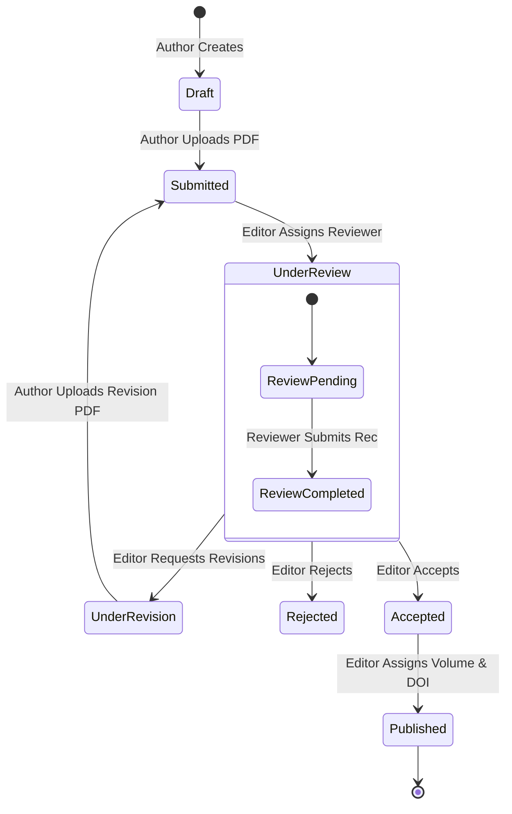

# 📖 Journal of Edge Computing (JEC) - Editorial & Publishing System

An enterprise-grade, lightweight **E-Journal & Peer Review Management System** built on **ASP.NET Core 8.0** and **SQLite**. This portal features role-based access control, a secure double-blind manuscript evaluation workflow, and SEO-optimized public archives with Google Scholar indexing support.

---

## 🏗️ Double-Blind Peer Review Workflow

This system enforces strict state transitions. The workflow is illustrated in the diagram below:



---

## 🛠️ Technology Stack

*   **Backend Framework:** ASP.NET Core 8.0 (MVC / Razor Pages)
*   **Database (ORM):** SQLite + Entity Framework Core 8.0
*   **Security & Auth:** Claims-based Cookie Authentication (Custom claims)
*   **Cryptography:** PBKDF2 with SHA-256 for secure password hashing
*   **Storage System:** Secure Private File Directory (Manuscripts are stored outside the public `wwwroot` folder prior to publication)
*   **Styling (UI):** Premium, custom-engineered Academic Vanilla CSS (featuring *Playfair Display* & *Inter* typography)
*   **SEO Integration:** Dynamic Dublin Core metadata injection for Google Scholar indexing

---

## 🔒 Demo Credentials (Automatic Seeding)

Upon the first startup, the database is automatically migrated and seeded with these roles:

| Role | Email | Password | Access Rights |
| :--- | :--- | :--- | :--- |
| **Chief Editor** | `editor@journal.com` | `Editor123!` | Process submissions, assign reviewers, publish issues |
| **Dr. Alice (Reviewer 1)** | `reviewer1@journal.com` | `Reviewer123!` | Double-blind review queue, submit recommendations |
| **Prof. Bob (Reviewer 2)** | `reviewer2@journal.com` | `Reviewer123!` | Double-blind review queue, submit recommendations |
| **Dr. John Doe (Author)** | `author@journal.com` | `Author123!` | Submit manuscripts, review feedback, upload revisions |
| **System Admin** | `admin@journal.com` | `Admin123!` | Full control over users and settings |

---

## 🚀 Getting Started (Run Locally)

### Prerequisites
*   [.NET SDK 8.0](https://dotnet.microsoft.com/en-us/download/dotnet/8.0)

### Quick Run
1.  **Clone the Repository:**
    ```bash
    git clone <your-repository-url>
    cd <repository-directory>
    ```
2.  **Build and Start the Application:**
    ```bash
    dotnet run
    ```
3.  **Access the Portal:**
    Open your browser and navigate to **`http://localhost:5077`**. The database will automatically initialize (`ejournal.db`) and seed the demo data.

---

## 🛡️ Key Security Implementations

*   **Folder Isolation:** Submitted manuscripts are kept in the private `/Uploads/` folder. Access is restricted using a secure download controller checking the user's role and database associations (e.g. only assigned reviewers or the author can access the PDF).
*   **Double-Blind Review:** Reviewers can read abstracts and download PDFs, but author names and academic designations are scrubbed from the reviewer interfaces.
*   **SQL Injection & XSS Protection:** EF Core parameterized queries block SQL injection, while ASP.NET Razor HTML-encodes all dynamic text values automatically.
